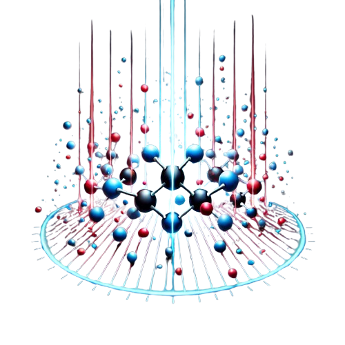
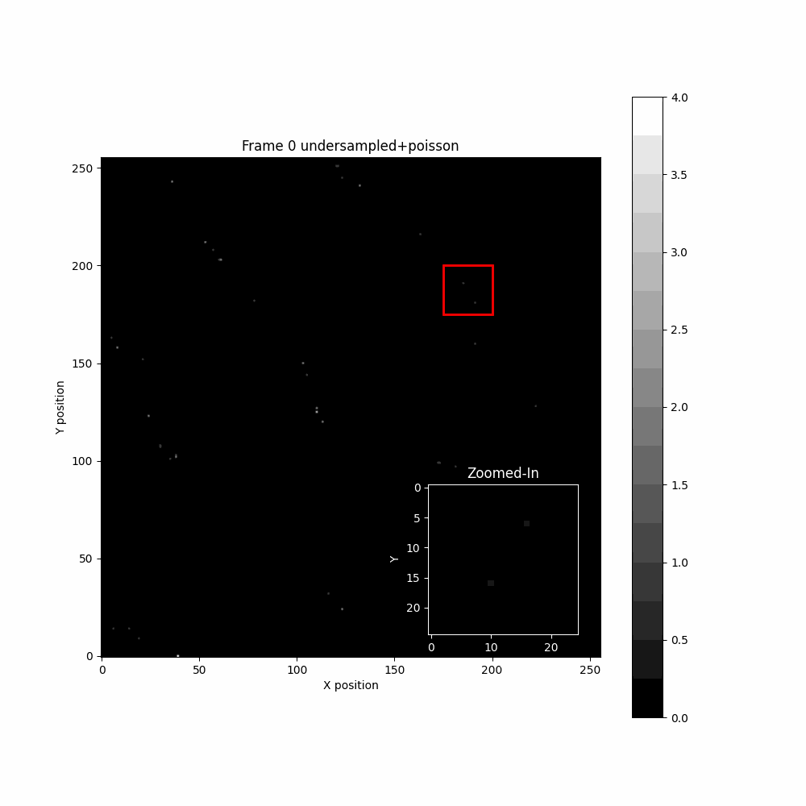

# Fluorescence Fluctuations Simulation

This repository provides tools to simulate super-resolution imaging techniques such as STORM and PALM, as well as fluorescence fluctuations, using Markov chains to model transitions between quantum states. The simulations are designed to help researchers and students understand the underlying processes and visualize the effects of photophysics and camera imperfections on the final images.

| PALM Simulator | STORM Simulator | Fluctuations Simulator |
|:--------------:|:---------------:|:----------------------:|
|  |  |  |

## Overview

The simulation framework is built around several key scripts and Jupyter notebooks that allow users to simulate the behavior of fluorescent molecules under different conditions, analyze photon emission statistics, and visualize the resulting super-resolution images.

### Contents

- **camera.py**:  
  This script simulates the effects of camera parameters on super-resolution images. It includes models for blur, undersampling, and Poisson detection noise, allowing users to understand how camera characteristics impact the quality of the final image.

- **photophysics.py**:  
  This script models the photophysics of fluorescent molecules, specifically the transitions between quantum states using Markov chains. It simulates how molecules transition between states such as 'on', 'off', and 'blinking', which is crucial for super-resolution imaging techniques like STORM and PALM.

- **photons_stats.py**:  
  This script is used to analyze the statistics of photon emissions based on the output from the `photophysics.py` script. It computes various metrics, plots histograms, and fits the data to appropriate statistical models to provide insights into the behavior of the fluorescent molecules.

- **one_molecule_simulator.ipynb**:  
  A Jupyter notebook designed to simulate super-resolution and fluorescence fluctuation protocols on a single molecule. This is useful for studying the detailed behavior of individual molecules under different experimental conditions.

- **fluorescence-simulation-on-an-image.ipynb**:  
  A Jupyter notebook that extends the simulation to multiple molecules distributed in a biological structure. This notebook allows users to visualize how the collective behavior of many molecules contributes to the overall super-resolution image.

